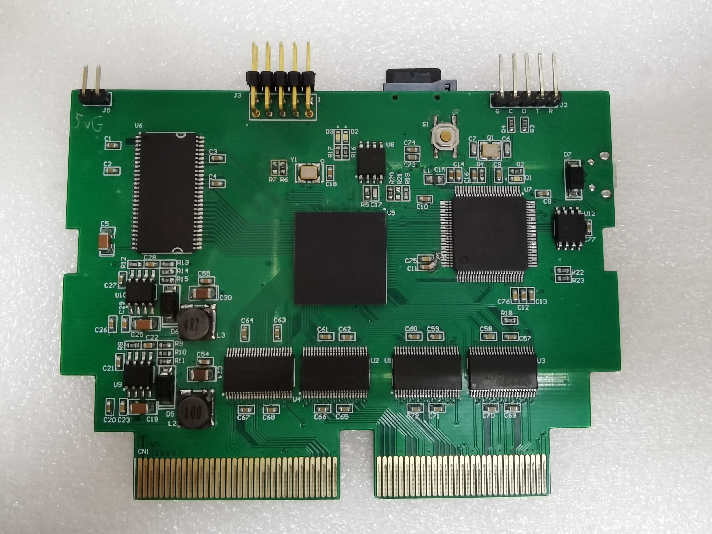
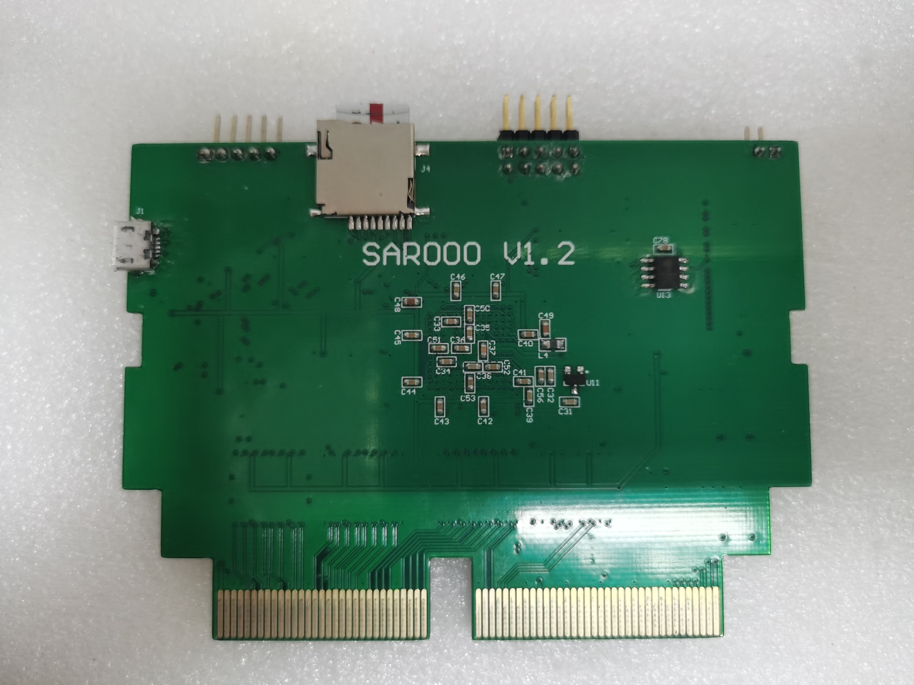
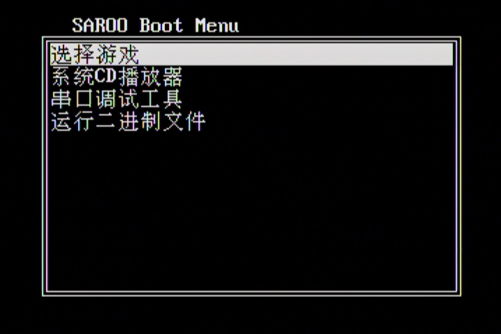
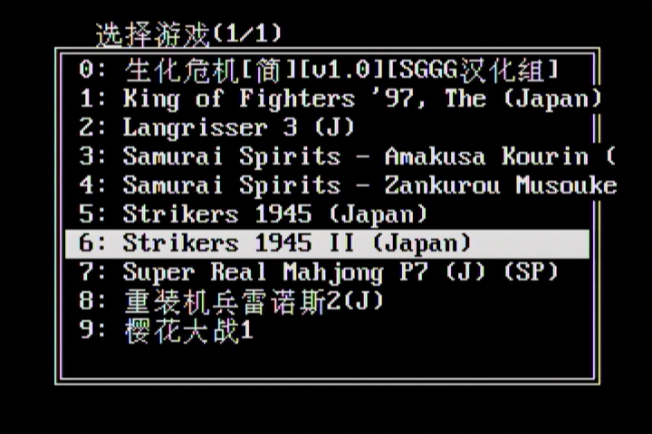
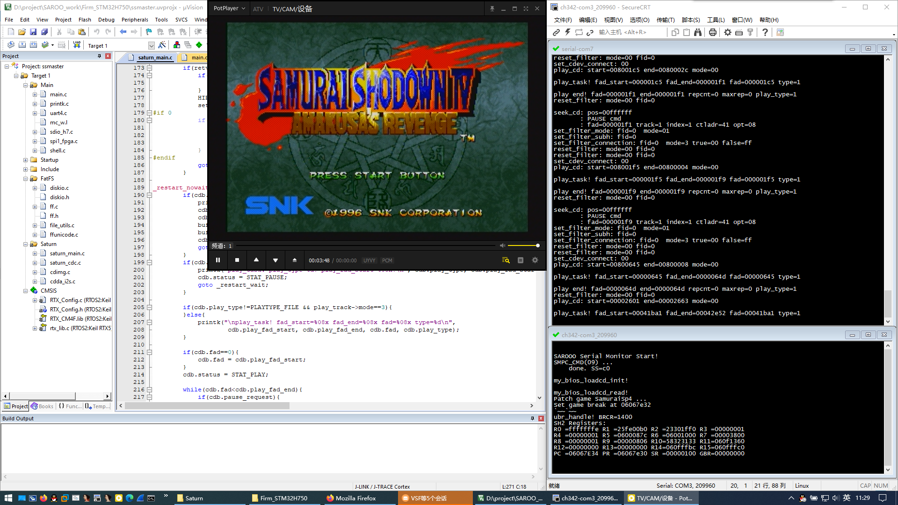
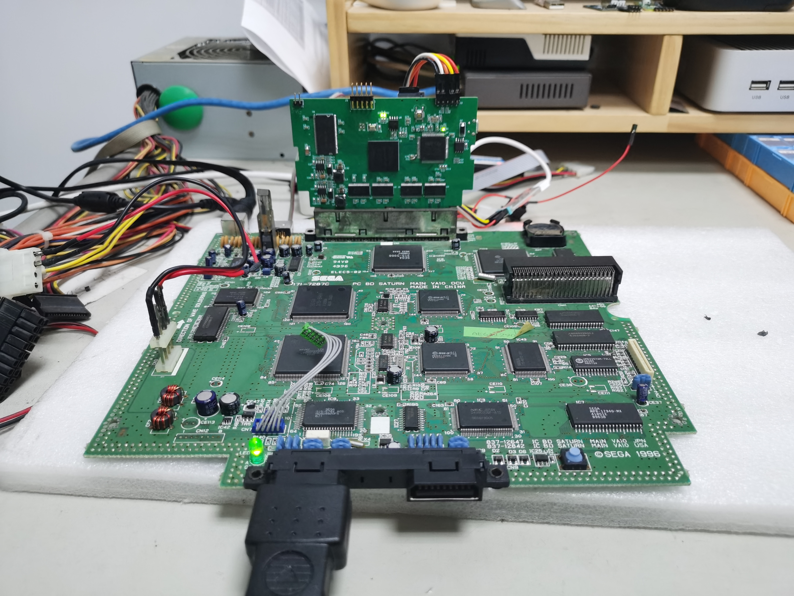

### SAROO is a HDLoader for SEGA Saturn.

SAROO is a Saturn optical drive emulator. SAROO is inserted into the cartridge slot and implements the functionality of the original motherboard's CDBLOCK, loading games from an SD card and running them.
SAROO also provides 1MB/4MB RAM expansion card functionality.

--------
### Some Pictures

  
  

--------
### Development History

#### V1.0
The original SAROO was simply a common usbdevcart with an added USB host interface. It required hacking the game's main program to convert CDBLOCK operations into USB drive operations.
This approach required modifications for each individual game and lacked universality. Performance and stability also had significant issues. Only a few games could run using this method.
(V1.0 related files are not included in this project)

#### V1.1
The new version had a completely new design. It used an FPGA+MCU approach. The FPGA (EP4CE6) implemented the CDBLOCK hardware interface, and the MCU (STM32F103) ran firmware to handle various CDBLOCK commands.
This version basically achieved its intended purpose, and some games could almost run. However, there was one fatal problem: random data errors. Various artifacts would appear when playing opening animations,
and it would eventually crash. This problem was very difficult to debug and locate. This caused the project to stagnate for a long time.

#### V1.2
Version 1.2 is a bugfix and performance improvement over version 1.1, using a higher performance MCU: STM32H750. It has a high enough frequency (400MHz) and enough internal SRAM to accommodate the complete CDC buffer.
The FPGA internals were also refactored, abandoning the qsys system and using a self-implemented SDRAM and bus structure. This version lived up to expectations and is already in a near-perfect state.
At the same time, by back-porting the FPGA and MCU firmware to V1.1 hardware, V1.1 has also basically achieved V1.2 performance.

--------
### Current Status

Dozens of tested games can run perfectly.  
1MB/4MB RAM expansion card functionality can be used normally.  
SD card supports FAT32/ExFAT file systems.  
Supports cue/bin format image files. Single bin or multiple bins.  
Some games may freeze on the loading/opening animation screen.  
Some games may freeze during gameplay.  

--------
### Hardware and Firmware

Schematics and PCB made using AltiumDesign14.  
V1.1 version requires jumper wires to work properly. This version should no longer be used.  
V1.2 version still requires an additional pull-up resistor to use the FPGA's AS configuration method.  

FPGA developed using Quartus14.0.  

Firm_Saturn compiled using SaturnOrbit's included SH-ELF compiler.  
Firm_v11 compiled using MDK4.  
Firm_V12 compiled using MDK5.  

--------
### SD Card File Placement

<pre>
/ramimage.bin      ; Saturn firmware program.
/SAROO/ISO/        ; Store game images. One game per directory. Directory name will be displayed in the menu.
/SAROO/update/     ; Store firmware for upgrading.
                   ;   FPGA: SSMaster.rbf
                   ;   MCU : ssmaster.bin
</pre>

--------
Some development notes: [SAROO Technical Notes](doc/SAROO_Technical_Notes_EN.txt)

